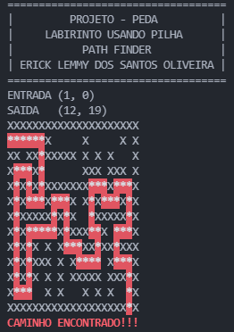
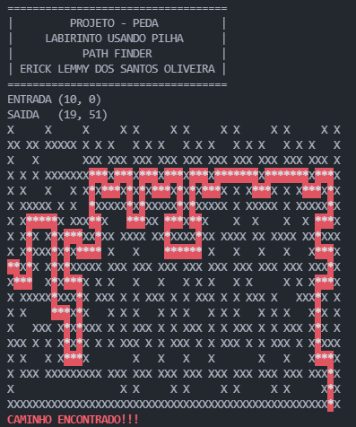

# Projeto 1 - PEDA
- LABIRINTO
- Erick Lemmy dos Santos Oliveira

# Entregue 
- 23/09/2021 
  
# Labirintos de Teste 
~~~cpp
int entradaX = 1;
int entradaY = 0;
Labirinto labirinto({
                "XXXXXXXXXXXXXXXXXXXXX",
                "E     X     X     X X",
                "XX XX XXXXX X X X   X",
                "X   X       XXX XXX X",
                "X X X XXXXXXX   X   X",
                "X X   X   X X X   X X",
                "X XXXXX X X   XXXXX X",
                "X X     X XXX  X    X",
                "X X X X X   XX XX XXX",
                "X X XXX X X     X   X",
                "X X X X X XXXXX XXX X",
                "X     X X   X X X   X",
                "XXXXXXXXXXXXXXXXXXXSX"
            });
~~~

~~~cpp
int entradaX = 10;
int entradaY = 0;
Labirinto labirinto({
    "XXXXXXXXXXXXXXXXXXXXXXXXXXXXXXXXXXXXXXXXXXXXXXXXXXXXX",
    "X     X     X     X X     X X     X X     X X     X X",
    "XX XX XXXXX X X X   X X X   X X X   X X X   X X X   X",
    "X   X       XXX XXX XXX XXX XXX XXX XXX XXX XXX XXX X",
    "X X X XXXXXXX   X   X   X   X   X       X       X   X",
    "X X   X   X X X   X X X   X X X   X X X   X X X   X X",
    "X XXXXX X X   XXXXX X XXXXX X XXXXX X XXXXX X XXXXX X",
    "X X     X XXX  X      XX    X  X    X  X    X  X    X",
    "X X X X X   XX XX XXXX XX XXXX XX XXXX XX XXXX XX XXX",
    "X X XXX X X     X   X           X   X   X   X   X   X",
    "E X X X X XXXXX XXX XXX XXX XXX XXX XXX XXX XXX XXX X",
    "X     X X   X X X   X   X   X X X   X X     X X X   X",
    "X XXXXX XXX X XXX X X XXX X X XXX X X XXX X   XXX X X",
    "X X       X X   X X X   X X X   X X X   X X X   X X X",
    "X   XXX X X XXX X X XXX X X XXX X X XXX X X XXX X X X",
    "XXX X X X X X X X XXX X X XXX X X XXX X X XXX X X XXX",
    "X X   X X   X       X   X   X   X       X   X   X   X",
    "X XXX XXXXXXXXX XXX XXX XXX XXX XXX XXX XXX XXX XXX X",
    "X                 X X     X X     X X     X X     X X",
    "XXXXXXXXXXXXXXXXXXXXXXXXXXXXXXXXXXXXXXXXXXXXXXXXXXXSX"
});
~~~

# Saida 
- saida 1  

- saida 2  
